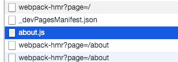

# Next-js-docs
Next js docs 내용 공부 repo

## 내가 이해하고 싶은 것
1. Next js에서 CSR 을하면 서버 사이드 렌더링 된 페이지들과 어떻게 같이 동작을 하는건지...??? 이개념이 아직 잘 안선다. link는 뭔건지... 라우팅 개념도 뭔가 아리까리하다. Link를 한다는게 csr을 한다는건가???
2. SPA 배포 경험도 없긴하지만, Next js 앱의 배포는 뭐가 다른건지. 
3. Next가 pages를 어떻게 관리를 하는건지.(내부 로직이 궁금)
4. Props도 어떻게 관리를 하는건지(내부로직이 궁금하다 이것도)

기타 등등. 

## Manual installation

`yarn add next react react-dom`

`npm run dev`

## Next js is built around the concept of pages

In Next js, a page is a React componenet exported from a '.js', '.jsx', '.ts', or '.tsx files in the 'pages' directory. Each page is associated with a route based on its file name.

default로 페이지를 만들면 서버에서 다 그려가지구, html파일을 보내준다. 그래서 자바스크립트 기능을 끄고도 html이 빈게 아니라 뭔가 채워져서 보이는 것을 알 수 있다. 

## [Dynamic routes](https://nextjs.org/docs/routing/dynamic-routes)

Defining routes by using predefined paths is not always enough for complex applications. 

Client-side navigations to dynamic routes are handled with `next/link`. -> 얘가 어떻게 동작한단건지 이해가 안된다. SSR 하다가 CSR 하면 CSR 할 페이지 관련 자바스크립트도 initial load할 때 다 갖다 줬단건지???

## [Linking between pages](https://nextjs.org/docs/routing/introduction#linking-between-pages)

The Next.js router allows you to do client-side route transitions between pages, similarly to a single-page application. 
-> Next js 라우터는 SPA 처럼 client-side route transition을 제공한다. ? 

- 추가로 읽어본 자료: 
  - [Render client-side only component in Next.js](https://haodong.io/render-client-side-only-component-in-next-js)
  - [Next js single page application](https://stackoverflow.com/questions/59475858/next-js-single-page-application)
  - [Headless CMS](https://www.sanity.io/blog/headless-cms-explained)

## [pages](https://nextjs.org/docs/basic-features/pages)
 디폴트 모드로, Next js는 모든 페이지를 pre-render한다. 그니까, 즉 HTML for each page 가 되도록 만든단거다. Client-side javascript가 다 하도록 냅두지 않규. 이렇게 하면 SEO 랑 퍼포먼스가 더 좋다고 한다. 각 generated HTML은 minimal javascript 코드랑 연계되가지구 브라우저가 페이지를 로드할때, 자바스크립트가 동작하면서 page를 다 그려낸다(hydration이라는 개념이라고 함)

## Routing, Linking and redirecting
https://www.youtube.com/watch?v=rwmZMjWpPYc&ab_channel=LeighHalliday

### [이거](https://github.com/Road-of-CODEr/we-hate-js/blob/master/Front-End/Next.js/basicFeatures/dataFetching/getServerSideProps.md)

next/link는 연결된 페이지를 prefetch한다. 관려해서 내용이 잘 이해가 안되서 찾아봤더니 아래의 글을 찾을 수 있었다. 

https://web.dev/route-prefetching-in-nextjs/

아래는 index.html , about.js 파일이다. \

console.log 를 통해서 언제 서버에 요청해서 페이지를 가져오는지 파악해봤다. 

 
이렇게 javascript를 disable 하면 about을 선택하면 서버에 다시 페이지를 요청해서 로그가 아래처럼 찍힌다. 

 

근데 js가 켜져있을땐, 서버에 요청안하고 client에서 처리가 된다. 

 

 

이렇게 보인다. 

